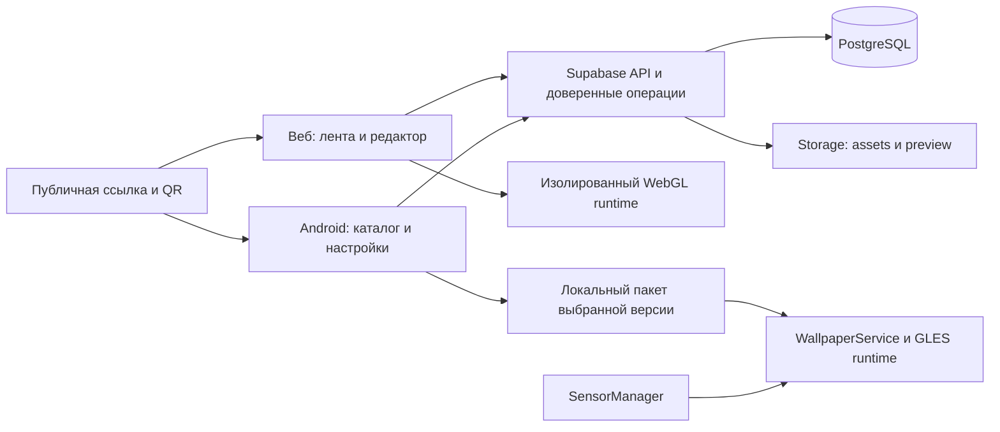

# Shader Gallery: техническое ревью и предполагаемая архитектура

Статус: рабочая рекомендация от 2026-09-13. Зависит от D1–D8 в [продуктовом документе](01-product.md). Это проектирование, реализация не начата. [План MVP](03-mvp-plan.md).

## 1. Ревью плана Gemini

Разумная основа: PostgreSQL/Supabase, нативный Android, CodeMirror, разделение UI и рендера, локальные данные обоев, единое описание входов шейдера. Но перечень библиотек и директорий пока опережает проверку главных рисков.

| Приоритет | Проблема в исходном плане | Исправление |
|---|---|---|
| P0 | «Полная совместимость» WebGL 1 и GLES 2 (строка 749) не доказана | Версионированный профиль, ограничения, тестовый набор и реальные GPU |
| P0 | Обои и оптимизация отложены до поздних фаз | Начать с работающего wallpaper + sensors на физическом телефоне |
| P0 | Есть code в shaders, но нет неизменяемых версий и происхождения | Work + Revision + ссылка на родительскую Revision |
| P0 | RLS приведён только фрагментами | Матрица доступа ко всем таблицам, Storage и операциям; тесты разных пользователей |
| P0 | Успешная компиляция считается достаточной | Отделить синтаксис, поддержку профиля, скорость и безопасность запуска |
| P1 | quality меняет только uniform размера (494–495) | Менять размер реального render target и viewport; затем масштабировать результат |
| P1 | Wallpaper lifecycle представлен эскизом | Surface lifecycle, потеря EGL, несколько Engine, process death, offline, fallback |
| P1 | Смещение рабочего стола предлагается писать в iMouse | Отдельный вход wallpaper offset; семантика указателя остаётся стабильной |
| P1 | REST-таблица похожа на собственный сервер, при этом выбран авто-API Supabase | Явно выбрать SDK/PostgREST для CRUD и RPC/функции для сложных операций |
| P1 | Счётчики могут выглядеть обычными редактируемыми полями автора | Производные значения или серверные транзакции; клиент их не устанавливает |
| P1 | Room + sync без правил конфликтов | Версии черновиков, optimistic concurrency и сохранение конфликтной копии |
| P1 | Google One Tap в таблицах, CredentialManager в примере | Унифицировать на Credential Manager; старые One Tap API не закладывать |
| P2 | exportMP4 возвращает WebM/VP9 (704+) | Назвать формат корректно, проверять поддержку MIME; MP4 — отдельная задача |
| P2 | Срок 10 недель без команды, устройств и критериев готовности | Оценка после технического исследования и ответов D1–D8 |

По RLS: отсутствие отдельного WITH CHECK в примере UPDATE само по себе не доказывает дыру — PostgreSQL может использовать USING и для проверки новой строки. Реальные пробелы: неполнота политик, права на столбцы, Storage, модерация и доверенные операции. См. [документацию Supabase](https://supabase.com/docs/guides/database/postgres/row-level-security).

Google рекомендует [Credential Manager для Sign in with Google](https://developer.android.com/identity/sign-in/credential-manager-siwg); [release notes](https://developers.google.com/android/guides/releases) фиксируют deprecation прежних One Tap API. В плане уже есть намёк на правильный API — требуется устранить противоречие, а не переписать всё из-за названия.

## 2. Конкретные ограничения текущего кода

- dist/shaders.js, ShaderView.tick: paused останавливает iTime, но draw продолжает вызываться. В reduced-motion и под открытым диалогом остаётся ненужный рендер видимых canvas. Нужен dirty-render при паузе.
- Каждая карточка получает свой WebGL context, буфер и цикл requestAnimationFrame. Все найденные работы монтируются сразу. Для большой ленты нужна виртуализация и ограничение активных preview.
- preserveDrawingBuffer включён для всех canvas. Для обычной ленты это лишнее постоянное требование; снимок получать отдельным управляемым проходом.
- iMouse формируется как x/y/флаг кнопки/0 и только при pointermove. Это не семантика iMouse Shadertoy, где zw связаны с координатами нажатия. Нужны pointerdown/up/cancel, capture и документированный контракт.
- Нет обработки webglcontextlost/restored, явного device capability report и ограничения тяжёлого пользовательского рендера.
- Ремикс хранит происхождение только в description; publish не записывает parent ID.
- Один ключ черновика в localStorage; автор и профиль зашиты в коде; follow не участвует в подборе ленты.
- Авторизация, серверная публикация, лицензии, Android и реальные межпользовательские сценарии отсутствуют по назначению прототипа.

Доработки рендера нужны независимо от выбора UI-фреймворка. Перенос app.js целиком под React сам по себе эти проблемы не решает.

## 3. Предлагаемый стек

| Слой | Рекомендация | Почему / развилка |
|---|---|---|
| Веб | TypeScript + React + Vite | Удобнее развивать редактор, async state, маршруты и формы. Существующий CSS и визуальную структуру сохранить. Vanilla + TS допустим при жёстком лимите объёма |
| Редактор | CodeMirror 6 | Отдельный компонент, undo/redo, номера строк, диагностика; сначала без LSP |
| Web runtime | WebGL 2, GLSL ES 3.00 | Рекомендуемый современный профиль; окончательно после проверки целевых устройств. WebGL 1/GLES 2 — сознательная альтернатива для старых устройств |
| Android | Kotlin, Compose, GLES 3, WallpaperService | Нативный lifecycle обоев и SensorManager; WebView не является основным движком обоев |
| Backend | Supabase: PostgreSQL, Auth, Storage | Один backend для веба и телефона; managed вариант зависит от бюджета/географии |
| API | Supabase SDK/PostgREST + ограниченные RPC/Edge Functions | Не дублировать весь CRUD собственным REST-сервером и Retrofit без причины |
| Локальное хранение | IndexedDB для веб-черновиков; Room/файлы/DataStore на Android | Отделить исходники, загруженные пакеты и небольшие настройки |
| Публичные страницы | Маршруты /works/:id + HTML metadata на сервере/edge | Превью ссылок должно работать для роботов без исполнения JS; hash URL недостаточно |
| Проверки | Контрактные fixtures, DB/RLS integration, браузерные сценарии, Android device tests | Проверяем поведение на границах систем |

Точные версии фиксировать lockfiles при старте реализации. Хостинг демо сейчас отмечен .openai/hosting.json; backend и production-маршруты ещё не выбраны. Не считать статический хостинг достаточным для динамических OG-страниц. Supabase SDK для Kotlin и его статус поддержки необходимо учесть при выборе клиента; не называть его автоматически официальным SDK Android.

## 4. Границы системы

Общие между платформами: спецификация пакета, семантика входов, JSON Schema, тестовые шейдеры и ожидаемое поведение. TypeScript и Kotlin не разделяют WebGL/GLES-код буквально. Не вводить Kotlin Multiplatform только ради общего названия моделей.

Монорепозиторий на старте: apps/web, apps/android, packages/shader-contract, fixtures/shaders, supabase/migrations, docs. В текущей папке нет .git; создание репозитория и CI входит в начало реализации.

## 5. Контракт работы и рендера

Единица публикации — **Work**, исполняемое содержимое — неизменяемая **Revision**. Публикация новой версии не меняет уже установленную на телефон версию самопроизвольно.

Минимальное содержимое ShaderPackage v1:

- schemaVersion, workId, revisionId, contentHash;
- runtimeKind = shader, renderProfile и entryPoint;
- исходник и ссылки на ресурсы с хешами/размерами, если ресурсы входят в выбранный профиль;
- авторство, licenseId, текст уведомлений, parentRevisionId и source URL;
- definitions параметров: имя, тип, диапазон, значение по умолчанию;
- required/optional capabilities, fallback для отсутствующих входов;
- preview, сведения о проверенных устройствах/режимах.

Первая рекомендуемая версия: один fragment pass, mainImage, время/размер/указатель, авторские scalar/color параметры и ограниченные сенсорные входы. Текстуры и feedback буфер добавляются только после D5. Формат пакета допускает расширение, но MVP не реализует универсальный граф проходов.

Для старых шести demo shader нужен явный adapter к выбранной версии GLSL. «Поддерживаем mainImage» не означает «поддерживаем весь Shadertoy». У Shadertoy есть [iChannel, временные входы и другие uniforms](https://www.shadertoy.com/view/4sVfWt); WebGL накладывает [собственные ограничения](https://registry.khronos.org/webgl/specs/latest/1.0/). На разных GPU дополнительно различаются precision, extensions и производительность.

Стабильно определить: секунды и поведение часов при паузе; координаты и origin; sRGB/linear для цвета; размеры реального render target; ориентацию экрана; размер/тип текстур; fallback. Служебные строки обёртки учитывать при показе ошибок редактора.

## 6. Датчики и заимствование ShaderEditor

Проверен upstream commit 513e79fc130f2f0ffc9d2ac4940fc2b263533ead, полученный через GitHub API. Это снимок ревью, не автоматическое решение использовать HEAD при сборке.

Полезные места:

- [BuiltinSensorUniforms.java](https://github.com/markusfisch/ShaderEditor/blob/513e79fc130f2f0ffc9d2ac4940fc2b263533ead/app/src/main/java/de/markusfisch/android/shadereditor/opengl/BuiltinSensorUniforms.java): подключение нужных датчиков, fallback, преобразование координат, передача uniforms и отключение listeners.
- [ShaderWallpaperService.java](https://github.com/markusfisch/ShaderEditor/blob/513e79fc130f2f0ffc9d2ac4940fc2b263533ead/app/src/main/java/de/markusfisch/android/shadereditor/service/ShaderWallpaperService.java): связь видимости, касаний и смещения рабочего стола с renderer.
- [ShaderEditor.java](https://github.com/markusfisch/ShaderEditor/blob/513e79fc130f2f0ffc9d2ac4940fc2b263533ead/app/src/main/java/de/markusfisch/android/shadereditor/widget/ShaderEditor.java): Java View с подсветкой, редакторскими зависимостями и адаптацией части Shadertoy-кода.

Это не готовые независимые SDK: sensor-класс зависит от hardware listeners, GlDevice, ProgramBindings и констант renderer; редактор зависит от базового View, highlighter, ресурсов и состояния приложения. Полный граф зависимостей и сборка форка ещё не проверены.

Рекомендация: извлечь нужную сенсорную и renderer-логику за собственный адаптер; редактор переносить при подтверждении D4. Java View можно встроить в Compose через AndroidView, но это требует выделения зависимостей и проверки IME/выделения/undo. Не переписывать зрелую редакторскую логику в BasicTextField только ради единого UI-стека.

Свой SensorBridge: единицы SI, система координат, поворот экрана, сглаживание, настройка чувствительности и калибровка нейтрального положения. Отдельно различать угловую скорость гироскопа и ориентацию устройства. Отсутствующий датчик имеет флаг available=false и определённое нейтральное значение. Симулятор в веб-редакторе помогает автору без телефона, но не считается проверкой реального датчика.

Регистрировать только необходимые датчики на время видимого рендера. Значения остаются локальными; базовый backend хранит определения входов и настройки, а не поток сенсоров. Телефон как удалённый контроллер — отдельный вариант D6 с pairing, транспортом, сроком жизни сессии и дополнительной проверкой задержек.

Сохранить MIT/copyright и сведения о заимствовании; лицензии ресурсов/зависимостей проверять отдельно. Основание: [LICENSE upstream](https://github.com/markusfisch/ShaderEditor/blob/master/LICENSE).

## 7. Backend и публикация

Основные таблицы: profiles, works, work_revisions, drafts, likes, saves, follows, comments, presets, assets, reports, user_blocks, moderation_actions. Именованные collections/collection_items — если выбраны вместо одной личной галереи.

works содержит author_id, slug/id, тип, метаданные, status и current_revision_id. Revision содержит исходник/manifest, content hash, лицензию и parent_revision_id. Черновик хранит base_revision_id и version для optimistic concurrency. Нужны уникальность реакций, запрет self-follow, ограничения длины, индексы ленты/автора/родителя.

Публикация — одна доверенная операция: проверить пользователя, лимиты, права на исходник, структуру пакета, ресурсы и ссылку происхождения; создать Revision; выставить её текущей; создать/привязать preview. Успех клиентской компиляции записывать как сведения о клиенте, не как серверную гарантию безопасности или Android-совместимости.

Публично читаются только опубликованные и доступные по правилам модерации работы. Черновики/личные пресеты и сохранения доступны владельцу. Автор меняет разрешённые поля своих работ, но не счётчики, чужое авторство или статус модерации. Moderation actions доступны ограниченной серверной роли. Service role отсутствует в клиентах.

Storage: отдельные правила upload/read/delete, связь объекта с владельцем и revision, лимиты размера/типа. Пользовательский SVG/HTML не размещать на origin приложения как исполняемый контент. Для preview предпочесть растровый формат. В MVP curated-работы проверять человеком; preview привязан к версии и не считается доказательством исполнения.

Лента: keyset pagination, «Новое», «Подписки», ручная подборка. Realtime не нужен для каждого лайка; уведомления можно добавить после базовой работы сообщества. Повтор запросов должен быть идемпотентным.

## 8. Производительность и исполнение

В ленте по умолчанию постеры; один активный live preview в зоне внимания. Число активных контекстов ограничено и измеряется. При паузе рисовать только изменённый кадр, при скрытой странице остановить работу. Обрабатывать потерю контекста и не терять черновик.

Пользовательский GLSL может перегрузить GPU. Ограничения длины/числа ресурсов полезны, но не гарантируют конечное время кадра. Изолированный renderer origin/iframe с минимальным протоколом защищает данные приложения; он не гарантирует защиты GPU-процесса от зависания драйвера. Тяжёлые работы не запускать автоматически. Нужны низкое начальное разрешение, замер frame time, понижение качества, fallback и восстановление после сбоя. Серверный рендер произвольных работ, если понадобится, выносится в отдельные ограниченные workers без секретов.

Android WallpaperService хранит локально revision и все необходимые ресурсы. Обрабатывает onSurfaceCreated/Changed/Destroyed, видимость, восстановление EGL и повторное создание процесса. У каждого Engine собственный lifecycle; настройки preview не должны неожиданно менять активные обои. Документация: [WallpaperService.Engine](https://developer.android.com/reference/android/service/wallpaper/WallpaperService.Engine).

Настройки качества меняют render target; FPS ограничивает частоту кадров. При скрытых обоях отключаются draw и listeners. Ошибка новой работы оставляет последнюю рабочую версию или безопасный статический фон. Факт установки подтверждается состоянием системы, а не только нажатием кнопки; доступность home/lock вариантов зависит от устройства/лаунчера.

## 9. Скетчи и игры — условное расширение

При выборе D2: отдельный runtimeKind=p5, закреплённая версия runtime, отдельный origin, sandbox iframe без доступа к сессии, CSP и запрет произвольной сети/навигации по умолчанию. Ограниченный postMessage-протокол, квоты ресурсов и собственное состояние игры. Не запускать пользовательский JS через eval внутри приложения.

Общие сущности остаются Work/Revision/комментарии/ремикс, но capability androidWallpaper=false. Сначала один runtime и небольшой тестовый набор; импорт произвольных HTML5 bundles, npm-зависимостей, multiplayer и рейтинги результатов не входят автоматически.

## 10. Что пока не установлено

Целевые Android API/GPU и доступные телефоны; бюджет; команда и знакомый стек; managed/self-hosted инфраструктура и география; обязательность текстур/multipass; Android-редактор; лицензии пользовательских работ; канал выпуска APK/магазин; правила удаления оригиналов с существующими ремиксами. Эти вопросы влияют на сроки и должны разрешиться до окончательного планирования.
